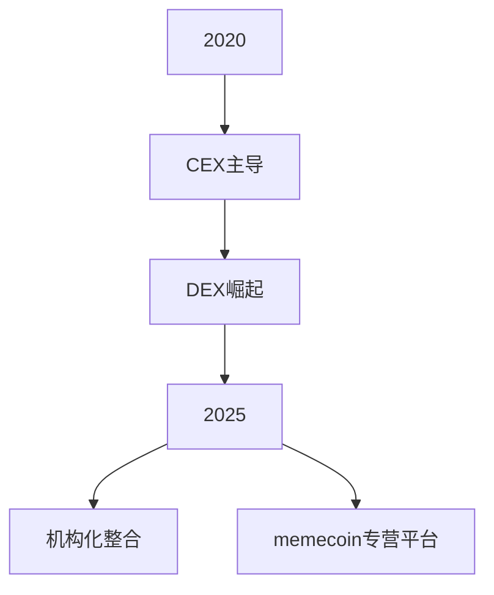

# Arthur Hayes深度解析加密市场未来走势：比特币崛起与山寨币转型

## 比特币价格预期：从25万到百万美元的逻辑推演

👉 [探索比特币价格飙升背后的经济模型](https://bit.ly/okx_welcome)

根据BitMEX创始人Arthur Hayes的深度分析，比特币价格将在2025年底达到25万美元，并预计在流动性泛滥的推动下于2028年突破百万美元大关。这一预测基于美国政府计划投放的5万亿美元基础货币，叠加银行系统通过补充杠杆率豁免政策释放的1万亿美元购买力。

| 市场指标          | 当前值       | 预测目标     |
|-------------------|-------------|-------------|
| 比特币市场主导率   | 65%         | 70%         |
| 年底价格预期      | -           | $250,000    |
| 2028年价格预测    | -           | $1,000,000  |

### 比特币的核心优势
- **稀缺性**：2100万枚总量的硬性约束
- **去中心化特性**：规避主权货币贬值风险
- **市场流动性**：相对较小的市值更容易被资金推动

**FAQ：为什么比特币比黄金更适合对抗通胀？**  
比特币的供应弹性为零，而黄金年产量仍保持2%增长。在极端货币宽松环境下，绝对稀缺属性将凸显价值优势。

## 山寨币市场重构：从叙事驱动到价值投资的转型

👉 [发现潜力山寨币的黄金法则](https://bit.ly/okx_welcome)

当前山寨币市场呈现两极分化态势，Hayes指出："缺乏产品市场适配性的项目将难以复苏，那些完全稀释估值(FDV)超50亿美元却无实际收入的项目，边际增长难度呈指数级上升。"

### 优质山寨币筛选标准
1. **真实产品市场适配**（如Pendle、Ethfi）
2. **可持续现金流创造能力**
3. **合理的代币经济模型**
4. **明确的收益分配机制**

**案例对比**：
- 失败案例：Berachain（高FDV+零收入）
- 成功范式：Monad（实际用户付费验证）

**FAQ：如何判断山寨币的估值合理性？**  
建议采用"市销率(P/S)"指标，即FDV与年化收入的比值。优质项目该指标应低于传统科技公司平均水平。

## 加密市场基础设施的进化路径

永续合约发明者Hayes揭示产品设计底层逻辑："我们创造无交割日合约的核心诉求，是解决80%用户无法理解传统期货价差的痛点。"当前交易所竞争已进入白热化阶段，创新方向呈现两大特征：
- **产品同质化加剧**：主流交易所手续费差异不足0.1%
- **营销战升级**：JP摩根等传统机构入场倒逼创新

**竞争格局演变**：

**FAQ：去中心化交易所真的安全吗？**  
Hyperliquid事件揭示：绝对去中心化与流动性供给存在根本矛盾。建议采用"流动性-去中心化平衡指数"评估平台风险。

## 全球资本流动与加密市场的共振效应

台币异常升值案例揭示深层逻辑：Hayes指出"台湾寿险公司持有的万亿美元级美债资产再平衡，可能引发10%以上的汇率修正"。这种资本回流现象正在韩国、新加坡等亚洲市场同步显现。

**国际资本流动趋势**：
- 美债外资持有量下降12%
- 新兴市场本币资产配置提升
- 比特币作为新型避险资产的接受度达67%

**政治风险预警**：
- 美国大选或影响比特币战略储备
- 稳定币法案可能重塑美元数字化路径
- 资本管制将采用渐进式实施策略

👉 [把握全球资本转移的黄金窗口](https://bit.ly/okx_welcome)

## 机构投资者的布局策略

Maelstrom基金的资产配置揭示专业机构思路：
- **核心持仓**：比特币（65%+）
- **战略配置**：以太坊（20%）
- **风险投资**：Pendle等协议代币（15%）

其交易哲学强调：
1. 年度换仓频率控制在2次以内
2. 采用"项目收益回购比特币"的增强策略
3. 专注收购现金流稳定的加密企业

**代际财富转移危机**：
- 婴儿潮世代资产规模：$30万亿美元
- Z世代购房需求缺口：2800万套
- 政府货币化解决方案概率：83%

## 市场情绪监测与风险管理

关键指标观察体系：
- 未平仓合约：历史新高898亿美元
- 基差溢价率：当前4.7%（警戒线8%）
- 恐慌贪婪指数：72（过热阈值）

风险管理黄金法则：
1. 单笔亏损不超过本金2%
2. 杠杆倍数≤账户净值波动率
3. 跨市场对冲持仓占比≥40%

**FAQ：如何识别市场顶部信号？**  
关注"现货-期货溢价背离"现象：当价格新高但溢价收窄时，有78%概率进入顶部区域。

## 未来十年的范式转移

Hayes预言三大变革趋势：
1. **货币形态革命**：CBDC与加密货币共存新格局
2. **资产证券化**：现实世界资产(RWA)上链规模突破10万亿美元
3. **交易终端变革**：VR交易界面市场渗透率将达45%

**代际投资观冲突**：
| 维度        | 婴儿潮一代    | Z世代       |
|------------|-------------|------------|
| 资产偏好    | 房地产      | 数字资产   |
| 风险承受度  | 32%         | 67%        |
| 投资周期    | 5-10年      | 1-3个月    |

这种结构性矛盾或将催生新型财富管理模式，预计到2030年，加密原生资产管理规模将突破15万亿美元。