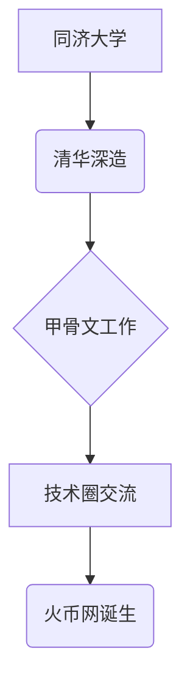

# 李林：从技术极客到区块链先锋的创业之路

## 创业基因的觉醒
清华自动化系的学术背景为李林埋下了技术创新的种子。在甲骨文公司的工作经历让他接触到前沿技术生态，却也激发出更强烈的创业渴望。2010年创办的团购导航网站人人折，不仅验证了其商业嗅觉，更积累了宝贵的互联网运营经验。这个阶段积累的资源与认知，为后续区块链领域的突破奠定了坚实基础。

👉 [区块链技术如何改变传统金融格局？](https://bit.ly/okx_welcome)

## 数字货币时代的破局者
2013年5月，当比特币概念尚处萌芽阶段，李林已敏锐捕捉到技术变革的浪潮。火币网的诞生不仅源于对市场机会的洞察，更源自用户体验的极致追求——当时主流交易平台笨拙的操作界面，促使他决心打造更专业的交易生态。域名"huobiwang"的巧妙命名，既规避了潜在风险，又彰显出破旧立新的魄力。

### 关键里程碑
| 年份 | 发展节点 | 市场影响 |
|------|----------|----------|
| 2013.09 | 平台正式上线 | 首创免手续费模式 |
| 2013.12 | 单日交易额破10亿 | 占据全球50%份额 |
| 2014.06 | 完成A轮融资 | 红杉资本战略加持 |

## 行业生态的构建者
李林的贡献远超商业范畴。2014年三亚财经论坛上，他与金融监管高层的对话，标志着数字货币正式进入主流视野。在《清华金融评论》发表的行业政策研究，开创了学术领域系统性研究的先河。这些举措不仅提升了行业公信力，更为监管框架的建立提供了实践依据。

👉 [数字货币投资需要注意哪些风险？](https://bit.ly/okx_welcome)

### 核心创业理念
1. **用户至上原则**：从免手续费到交易体验优化，始终以用户需求为出发点
2. **技术驱动战略**：持续投入底层系统开发，保障高频交易稳定性
3. **生态共建思维**：通过开发者大赛培育技术人才，推动行业协同发展

## 企业家精神的多维诠释
### 早期创业启示
- **友谊网的挫折**：7万用户量的失败案例，让李林深刻认识到社交网络的冷启动难题
- **人人折的成功**：精准定位细分市场，两个月实现用户暴增，验证了其商业模式的有效性

### 个人成长轨迹

## 火币网的创新密码
平台崛起的关键在于精准把握了三个维度：
1. **流量运营**：通过免手续费政策快速聚拢用户
2. **技术壁垒**：自主研发高并发交易系统，单日处理量超20万BTC
3. **品牌塑造**：持续参与高端行业论坛，建立专业形象

👉 [全球主流加密货币交易平台对比](https://bit.ly/okx_welcome)

### FAQ
**Q：火币网成立初期采取了哪些策略迅速占领市场？**  
A：采用永久免手续费的颠覆性政策，配合精准的流量运营，上线首月即实现盈利。

**Q：李林如何看待区块链技术的未来发展？**  
A：从2014年的演讲内容可见，他始终强调技术落地的重要性，主张通过创新应用推动产业变革。

**Q：火币网的成功对创业者有何启示？**  
A：证明了"痛点驱动"的创业模式的有效性，同时也展示了技术积累与资本运作的协同效应。

## 行业影响的持续发酵
作为首批将区块链技术商业化的探索者，李林的实践为后续创业者提供了重要参考。从早期的比特币交易到多元化数字资产生态，其商业版图的每一次扩张都在重塑行业边界。这种持续创新的精神，正是区块链领域保持活力的核心动力。
