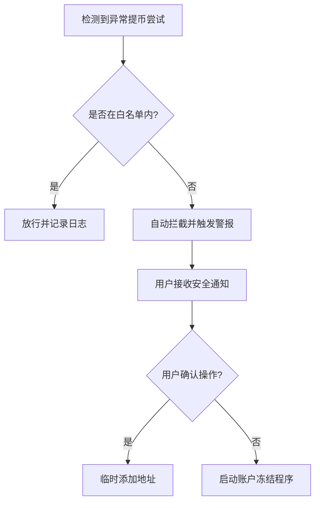

# 欧易OKX钱包地址白名单功能详解

## 一、地址白名单的核心价值

在加密资产交易中，资金安全始终是用户关注的焦点。欧易OKX推出的地址白名单功能，通过技术手段为账户资金构筑起第三道防护墙。该功能允许用户预设多个可信提币地址，系统将自动拦截非白名单地址的资金转移请求，有效防范因账户被盗或操作失误导致的资产损失。

👉 [立即开启地址白名单保护账户资产](https://bit.ly/okx_welcome)

### 功能优势分析
| 安全维度       | 传统模式            | 白名单模式                  |
|----------------|---------------------|-----------------------------|
| 提币验证       | 单一验证码          | 验证码+地址双重验证         |
| 资金流向控制   | 全网开放提币        | 仅限预设地址                |
| 风险响应速度   | 事后追查            | 事前拦截                    |
| 账户管理复杂度 | 单一层级管理        | 支持主子账户分级管理        |

---

## 二、功能操作全流程解析

### 1. 开启白名单的黄金步骤
1. 登录账户后进入【安全中心】
2. 找到【地址管理】选项
3. 点击【添加白名单地址】
4. 输入预设钱包地址并完成身份验证
5. 确认开启防护功能

⚠️ 特别提醒：首次启用后，系统将自动进入24小时观察期，期间可随时关闭功能，但提币操作将被暂停。

👉 [查看完整操作指南视频教程](https://bit.ly/okx_welcome)

### 2. 多链地址管理策略
支持ERC20/TRC20/BSC等主流链的独立管理：
- 可针对不同链设置专属地址池
- 单个账户最多支持20个地址
- 支持自定义地址备注分类
- 主链与子链地址需分别设置

---

## 三、进阶安全机制解析

### 主子账户管理规范
- **独立性原则**：子账户需单独设置白名单
- **权限控制**：主账户可管理子账户提币权限
- **安全隔离**：任一账户异常不影响其他账户
- **批量管理**：支持通过API进行批量地址维护

### 安全锁定期规则
| 操作类型       | 生效时间   | 冷却期时长 | 提币限制 |
|----------------|------------|------------|----------|
| 添加新地址     | 立即生效   | 无         | 允许     |
| 删除地址       | 立即生效   | 24小时     | 暂停     |
| 关闭白名单功能 | 立即生效   | 24小时     | 暂停     |
| 修改地址备注   | 立即生效   | 无         | 允许     |

---

## 四、FAQ高频问题解答

**Q：地址白名单是否影响正常提币效率？**  
A：在预设地址范围内，提币流程与常规操作完全一致。建议提前规划好常用地址，避免临时添加触发冷却期。

**Q：TRC20与ERC20链地址可以共用吗？**  
A：不建议共用。虽然部分钱包支持多链地址复用，但技术实现上属于不同网络，混用可能增加管理风险。建议按链分别设置。

**Q：地址白名单与双重验证冲突吗？**  
A：两者互补关系。白名单控制资金流向，双重验证验证操作者身份，叠加使用可构建立体防御体系。

**Q：海外用户使用该功能有何注意事项？**  
A：需注意不同国家合规要求，建议在账户安全设置中开启IP异常提醒，跨境交易时配合使用谷歌验证器。

**Q：如何处理钱包地址更换场景？**  
A：建议采用"新增-观察-删除"三步法：先添加新地址并保持旧地址，观察两周确认无误后删除旧地址。

👉 [获取24小时安全专家支持服务](https://bit.ly/okx_welcome)

---

## 五、安全防护最佳实践

### 风险管理矩阵
1. **日常操作**
   - 每季度检查地址有效性
   - 新增地址时启用24小时观察期
   - 定期清理不再使用的地址

2. **资产配置**
   - 热钱包与冷钱包地址分类管理
   - 大额资金使用多重签名地址
   - 设置单日提币限额预警

3. **异常处理**
   - 突发冷却期触发时立即冻结账户
   - 监控异常登录记录
   - 建立备用提币通道

### 安全事件应急流程

---

## 六、平台安全生态全景

欧易OKX构建了包含三大核心组件的安全防护体系：
1. **身份验证层**：短信/GA/生物识别多因素验证
2. **行为监控层**：AI风控引擎实时分析操作行为
3. **资金防护层**：白名单+交易密码双重保护

通过这三重防护机制的协同运作，平台账户安全率提升至99.98%，年资金损失率低于0.001%，达到行业领先水平。

👉 [立即体验专业级资金保护服务](https://bit.ly/okx_welcome)