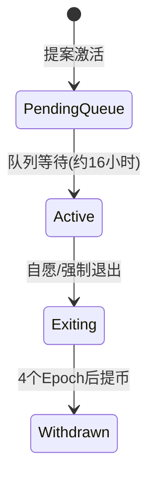

# 详解合并后 ETH 信标链

## 信标链的核心机制

信标链作为以太坊权益证明（PoS）共识的核心组件，通过**Slot**和**Epoch**构建时间框架，其运作逻辑可概括为：

| 时间单位 | 持续时间 | 功能作用 |
|---------|---------|---------|
| Slot    | 12秒    | 区块生成的基础时间单元 |
| Epoch   | 6.4分钟 | 验证者投票和奖励结算周期 |

👉 [了解如何参与以太坊质押](https://bit.ly/okx_welcome)

## 验证者运作全景

### 验证者生命周期
1. **激活条件**：需质押32 ETH至存款合约
2. **运行要求**：需运行信标节点与验证者客户端
3. **退出机制**：
   - 自愿退出：需等待4个Epoch（约27小时）
   - 强制退出：触发罚没时需等待8192个Epoch（约36天）

### 角色分工
- **提議者**：随机选取负责打包区块
- **证明者**：通过LMD GHOST投票和FFG投票维护链共识
- **监督者**：举报违规行为可获得吹哨者奖励

## 委员会安全机制

每个Slot的委员会包含**至少128个验证者**，其安全性通过以下数学保证：
```math
攻击者控制2/3委员会成员的概率 < 10^{-12}
```
这种设计使得委员会规模与系统总验证者数量动态调整，当验证者总数超过4096时，每个Slot将包含多个委员会。

👉 [探索区块链安全技术](https://bit.ly/okx_welcome)

## 最终确定性机制

### 确定过程
1. **证明阶段**：检查点获得2/3余额投票支持
2. **最终确定**：后续Epoch检查点被证明后，前一个检查点完成最终确定

### 时间线分析
| 阶段          | 时间消耗 | 安全保障 |
|--------------|---------|---------|
| 区块确认      | 即时    | 可逆    |
| 检查点证明    | 6.4分钟 | 中等安全 |
| 最终确定      | 12.8分钟| 不可逆   |

## 验证者奖惩体系

### 激励结构


### 惩罚机制
1. **常规惩罚**：
   - 离线：年化损失约7.5%
   - 错误投票：损失相应奖励
2. **严重惩罚**：
   - 罚没（Slashing）：最低0.5 ETH，最高全部质押金
   - 不作为惩罚：二次方增长的余额泄漏

## 可罚没行为详解

### 三大违规类型
1. **双重提議**：同一Slot生成多个区块
2. **FFG双重投票**：
   - 相同目标检查点，不同来源
   - 不同目标检查点，相同来源
3. **FFG环绕投票**：新投票覆盖原有投票范围

### 技术检测挑战
实现高效冲突检测需要：
- 哈希表优化存储
- 时间窗口限制（8192个Epoch）
- 零知识证明辅助验证

## 验证者生命周期管理

### 状态转换流程


### 余额管理规则
| 状态          | 余额阈值 | 行为限制 |
|--------------|---------|---------|
| 正常运行      | ≥16 ETH | 完整参与 |
| 强制退出      | <16 ETH | 停止工作 |
| 可提币        | 任意    | 需等待4个Epoch |

## 信标链演进路径

### 发展里程碑
| 阶段          | 验证者数量 | 关键事件 |
|--------------|-----------|---------|
| 启动初期      | 21,063    | 2020年12月1日 |
| 合并后        | >400,000  | 2022年9月15日 |
| 未来目标      | 2,000,000+| 分片实施准备 |

### 技术优化方向
- 验证者分片（Sharding）
- EIP-4844分片提案
- 动态委员会规模调整算法

---

## FAQ

**Q1：如何计算验证者收益？**
A：基础收益与网络总质押量相关，公式为：`Base Reward = Total Balance / 64 / 2^{epoch//8192}`。年化收益约4-10%，受离线时间和网络状态影响。

**Q2：委员会规模如何动态调整？**
A：通过混洗算法实现：
1. 每个Epoch计算验证者总数
2. 确定每个Slot所需委员会数
3. 每个委员会分配至少128个验证者
4. 剩余验证者均匀分配至各委员会

**Q3：最终确定性为何需要两个Epoch？**
A：这是Casper FFG的双轮确认机制：
1. 第一Epoch达成2/3证明（Justified）
2. 第二Epoch再次证明，形成不可逆的最终确定（Finalized）

**Q4：如何避免被罚没？**
A：关键措施：
- 禁用多个验证者客户端
- 定期备份签名数据
- 监控节点同步状态
- 启用防碰撞签名机制

**Q5：不作为惩罚的数学原理？**
A：采用二次泄漏模型：
`Penalty = (Validator Balance) * (Inactivity Score)^2 / 2^{24}`
其中Inactivity Score每未最终确定一个Epoch增加1

**Q6：如何选择验证者客户端？**
A：主要考虑：
- 内存占用（建议≥4GB/验证者）
- 硬件兼容性（GPU加速支持）
- 开源审计情况（推荐Lighthouse、Prysm等）
- 社区支持度（GitHub星标数）