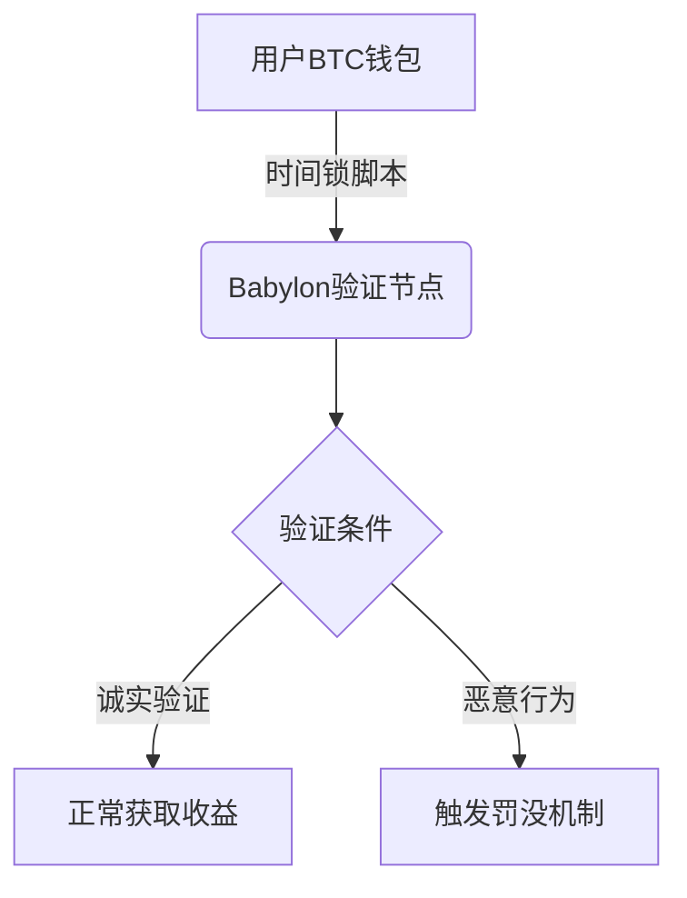

# Babylon是什么：用比特币增强权益证明安全性

区块链安全机制始终需要在效率与风险之间寻找平衡。权益证明（PoS）网络虽然具备能耗优势，却存在验证者离线、长程攻击等安全隐患。Babylon项目通过创新性地将比特币安全性引入PoS生态，构建了独特的非托管质押体系。这种技术突破不仅提升了区块链安全等级，更开创了资产跨链验证的新范式。

## 核心功能速览

- **安全强化**：整合比特币时间戳技术，为PoS链提供防篡改数据验证
- **资产控制权**：用户无需转移比特币即可参与质押，私钥始终掌握在用户手中
- **效率提升**：将传统PoS网络的解绑时间从数周缩短至24小时
- **生态兼容**：支持Cosmos生态、DeFi协议及Layer2解决方案的无缝对接
- **测试验证**：通过Testnet-4提供沙盒环境，确保主网上线前的技术可靠性

## 技术原理深度解析

### 非托管质押机制

传统质押模式要求用户将资产转移至目标链，这会带来桥接风险。Babylon采用UTXO锁定技术实现"影子质押"：

用户只需通过比特币钱包签署特殊交易，即可在不转移资产的情况下完成质押。这种设计将比特币网络的抗审查特性与PoS的效率优势完美结合。

### 比特币时间戳验证

每6小时，Babylon会将链上状态哈希写入比特币交易OP_RETURN字段。这种技术实现具有三大优势：

| 优势维度       | 传统PoS        | Babylon方案       |
|----------------|----------------|-------------------|
| 数据防篡改     | 依赖验证者共识 | 比特币算力保障    |
| 攻击成本       | 约33%代币攻击  | 等同比特币51%攻击 |
| 信任建立时间   | 需数周验证     | 即时确认          |

这种跨链验证机制有效防御了长程攻击（Long-Range Attack），使得新启动的PoS链能够立即获得比特币级别的安全背书。

### 防御性经济模型

Babylon引入双重惩罚机制保障网络安全：

1. **即时罚没**：当验证节点出现双签行为时，通过EOTS（可提取一次性签名）技术立即触发至少1/3质押量的罚没
2. **延迟惩罚**：离线超过72小时的验证者，每日将被扣除0.1%的收益

这种动态调整的经济模型使得攻击网络的边际成本远高于潜在收益，形成有效的威慑机制。

## 应用场景与生态布局

### 去中心化金融（DeFi）整合

Babylon的质押凭证（bBTC）可作为抵押品参与各类DeFi协议：

👉 [探索去中心化金融新生态](https://bit.ly/okx_welcome)

这种资产流动性解决方案显著提升了资本使用效率，用户在保障网络安全的同时，可参与借贷、交易等多场景应用。

### 跨链互操作性

通过与Cosmos IBC协议的深度整合，Babylon实现了：

- 跨链消息验证的原子性保证
- 资产跨链转移的零确认可信验证
- 多链安全共享机制

这种架构为构建多链互操作基础设施提供了新的安全范式。

### Layer2扩展方案

Babylon的时间戳服务为比特币Layer2网络提供：

- 防欺诈证明的即时验证
- 状态通道的安全锚定
- 交易排序的抗审查保障

这使得比特币网络能够支持每秒数千笔交易的处理能力，同时保持基础层的安全属性。

## 开发者支持体系

Testnet-4测试网络为开发者提供：

- 完整的质押节点部署环境
- 模拟攻击测试平台
- 时间戳服务压力测试工具

通过沙盒环境，开发者可以：

1. 验证智能合约的安全性
2. 测试跨链消息传递机制
3. 优化验证节点的经济模型参数

这种渐进式开发流程确保了主网的稳定性，目前测试网络已吸引超过200个开发团队参与。

## 常见问题解答

**Q：Babylon如何保障用户资产安全？**  
A：采用比特币原生脚本实现资产锁定，用户始终掌握私钥控制权。即使验证节点作恶，也无法转移用户资产。

**Q：质押收益如何计算？**  
A：年化收益率根据总质押量动态调整，当前预测为4-8%。收益分配采用链上治理机制，确保透明公正。

**Q：如何参与Babylon网络？**  
A：用户可通过支持BIP-329标准的钱包（如OKX Web3钱包）直接参与，无需迁移资产即可获取收益。

**Q：遭遇网络攻击时的应对机制？**  
A：比特币时间戳提供即时防篡改证明，配合罚没机制可在攻击发生时立即冻结恶意资产，恢复网络状态。

**Q：与传统PoS网络的核心差异？**  
A：Babylon将比特币的安全性作为基础层，通过时间戳技术实现跨链验证，解决了PoS网络的"无利害攻击"（Nothing at Stake）问题。

👉 [立即体验数字资产安全新标准](https://bit.ly/okx_welcome)

## 未来发展方向

Babylon计划在2025年实现三大技术突破：

1. **零知识证明优化**：将时间戳验证效率提升10倍
2. **多资产支持**：扩展至莱特币、狗狗币等主流PoW链
3. **预言机集成**：构建去中心化数据验证层

这些升级将推动Babylon从单一的质押协议进化为跨链安全基础设施，为Web3生态构建更可靠的信任基础。

通过将比特币的安全性转化为可编程的模块化服务，Babylon正在重塑区块链安全架构。这种创新模式不仅解决了PoS网络的根本性缺陷，更为数字资产的跨链互操作开辟了新路径。随着更多开发者的参与和应用场景的拓展，Babylon有望成为连接不同区块链生态的枢纽性协议。

👉 [把握区块链安全技术前沿动态](https://bit.ly/okx_welcome)